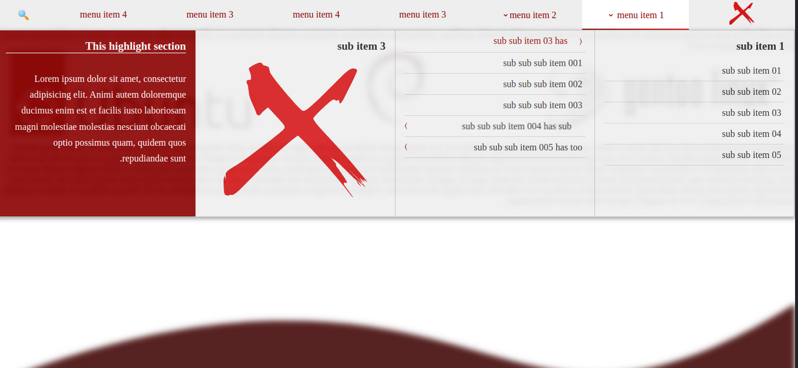
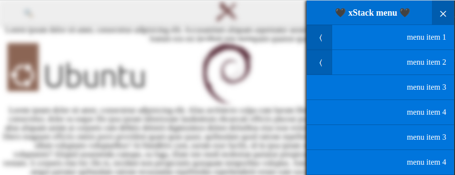
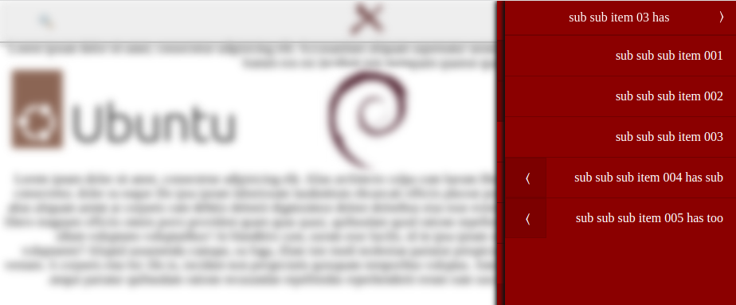
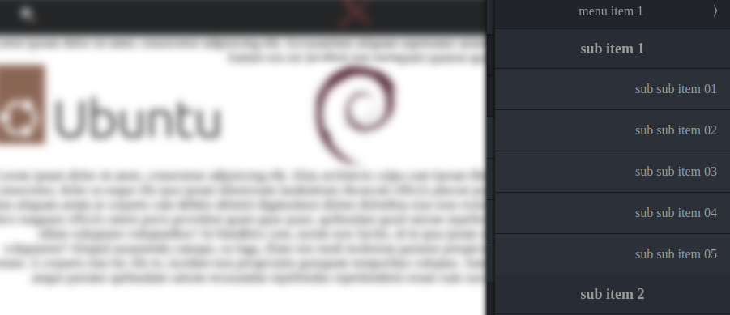

<h1 align="center">
  <br>
  <a href="https://github.com/4xmen/x-mega-menu">
    
  </a>
  <br>
  <a href="https://github.com/4xmen/x-mega-menu">X Mega Menu</a>
  <br>
  <hr>
</h1>


# X-Mega-Menu

x mega menu is easy usable multi level responsive with vanillaJS very fast and without any dependencies (ltr and rtl support).

## How use it?
With package manager:
````
npm i x-mega-menu
````
or
````
yarn add x-mega-menu
````

or you can use CDN package:

CSS ⬇️
````
<link rel="stylesheet" href="https://cdn.jsdelivr.net/npm/x-mega-menu@1.4.1/dist/x-mega-menu.min.css">
````
JavaScript ⬇️
````
<script src="https://cdn.jsdelivr.net/npm/x-mega-menu@1.4.1/dist/x-mega-menu.min.js"></script>
````

add assets:
```html
   <link rel="stylesheet" href="x-mega-menu/dist/x-mega-menu.min.css">
   <script src="x-mega-menu/dist/x-mega-menu.min.js"></script>
```

HTML:
```html
<nav>
    <ul id="mega-menu">
        <li>
            <a href="#">
                
            </a>
        </li>
        <li>
            <a href="#">
                menu item 1
            </a>
            <ul>
                <li>
                    <h3>
                        sub item 1
                    </h3>
                    <ul>
                        <li><a href="#">sub sub item 01</a></li>
                        <li><a href="#">sub sub item 02</a></li>
                        <li><a href="#">sub sub item 03</a></li>
                        <li><a href="#">sub sub item 04</a></li>
                        <li><a href="#">sub sub item 05</a></li>
                    </ul>
                </li>
                <li>
                    <h3>
                        sub item 2
                    </h3>
                    <ul>
                        <li><a href="#">sub sub item 01</a></li>
                        <li><a href="#">sub sub item 02</a></li>
                        <li>
                            <a href="#">sub sub item 03 has</a>
                            <ul>
                                <li><a href="#">sub sub sub item 001</a></li>
                                <li><a href="#">sub sub sub item 002</a></li>
                                <li><a href="#">sub sub sub item 003</a></li>
                                <li>
                                    <a href="#">
                                        sub sub sub item 004 has sub
                                    </a>
                                    <ul>
                                        <li><a href="#">sub sub sub item 001</a></li>
                                        <li><a href="#">sub sub sub item 002</a></li>
                                        <li><a href="#">sub sub sub item 003</a></li>
                                        <li><a href="#">sub sub sub item 004</a></li>
                                        <li><a href="#">sub sub sub item 005</a></li>
                                    </ul>
                                </li>
                                <li>
                                    <a href="#">sub sub sub item 005 has too</a>
                                    <ul>
                                        <li><a href="#">sub sub sub item 001</a></li>
                                        <li><a href="#">sub sub sub item 002</a></li>
                                        <li><a href="#">sub sub sub item 003</a></li>
                                        <li><a href="#">sub sub sub item 004</a></li>
                                        <li><a href="#">sub sub sub item 005</a></li>
                                    </ul>
                                </li>
                            </ul>
                        </li>
                        <li><a href="#">sub sub item 04</a></li>
                        <li><a href="#">sub sub item 05</a></li>
                    </ul>
                </li>
                <li>
                    <h3>
                        sub item 3
                    </h3>
                    
                </li>
                <li class="x-highlight">
                    <h3>
                        This highlight section
                    </h3>
                    <br>
                    <p>
                        Lorem ipsum dolor sit amet, consectetur adipisicing elit. Animi autem doloremque ducimus enim
                        est et facilis iusto laboriosam magni molestiae molestias nesciunt obcaecati optio possimus
                        quam, quidem quos repudiandae sunt.
                    </p>
                </li>
            </ul>
        </li>
        <li>

            menu item 2

            <ul>
                <li>
                    <h3>
                        sub item 1
                    </h3>
                    <ul>
                        <li><a href="#">sub sub item 01</a></li>
                        <li><a href="#">sub sub item 02</a></li>
                        <li><a href="#">sub sub item 03</a></li>
                        <li><a href="#">sub sub item 04</a></li>
                        <li><a href="#">sub sub item 05</a></li>
                    </ul>
                </li>
                <li>
                    <h3>
                        sub item 3
                    </h3>
                    
                </li>
                <li>
                    <h3>
                        sub item 1
                    </h3>
                    <ul>
                        <li><a href="#">sub sub item 01</a></li>
                        <li><a href="#">sub sub item 02</a></li>
                        <li><a href="#">sub sub item 03</a></li>
                        <li><a href="#">sub sub item 04</a></li>
                        <li><a href="#">sub sub item 05</a></li>
                    </ul>
                </li>

                <li class="x-highlight">
                    <h3>
                        This highlight section
                    </h3>
                    <br>
                    <p>
                        Lorem ipsum dolor sit amet, consectetur adipisicing elit. Animi autem doloremque ducimus enim
                        est et facilis iusto laboriosam magni molestiae molestias nesciunt obcaecati optio possimus
                        quam, quidem quos repudiandae sunt.
                    </p>
                </li>

            </ul>
        </li>
        <li>
            <a href="#">
                menu item 3
            </a>
        </li>
        <li>
            <a href="#">
                menu item 4
            </a>
        </li>
        <li>
            <a href="#">
                menu item 3
            </a>
        </li>
        <li>
            menu item 4
        </li>
        <li class="x-always-show x-small">
            🔍
        </li>
    </ul>
</nav>
```
javascript use:
```javascript
xMegaMenu('#mega-menu', {
    responseWidth: 1124,
    isRtl: true,
    mainTitle: '🖤 xStack menu 🖤',
    blurEffect: true,
    disableLinks: true,
    fixedTop: true,
    onCloseSideMenu: function () {
        console.log('closed');
    },
    onOpenSideMenu: function () {
        console.log('opened');
    }
});
```

# webpack or vite (`vuejs` or `reactjs`) usage

1. import css or scss
```scss
@import "~x-mega-menu/src/x-mega-menu";
```
2. import js and use it
```javascript
import xMegaMenu from 'x-mega-menu/dist/x-mega-menu';
xMegaMenu('#mega-menu', {
   // options  
});
```

# Screenshots

<div align="center">
<h2>Mega Menu Style</h2>

</div>
<div align="center">
<h2>Blue Theme</h2>

</div>
<div align="center">
<h2>Red Theme</h2>

</div>
<div align="center">
<h2>Dark Theme</h2>

</div>

## 🔗 Links
https://www.npmjs.com/package/x-tree-select
<br>
http://4xmen.ir/
<br>
https://xstack.ir

## DEMO (example)

- You can watch /example of project.
- [online demo](https://demos.4xmen.ir/x-mega-menu/example/)
- [online rtl demo](https://demos.4xmen.ir/x-mega-menu/example/index-rtl.html)

## option and events


| name  | default  |  action  |
| ------------ | ------------ | ------------ |
| responseWidth  |  `1024`  |  active mobile mode (side menu)  |
| barsIcon |  -  |  any html element use for toggle bar   |
| mainTitle  | `Navbar menu`  | change main menu title   |
| isRtl  |  `false` |  change direction to rtl |
|  blurEffect | `false`  |  blur effect when menu active |
|  resetMenu | `true`  | reset side menu when close  |
|  disableLinks | `true`  | disable links when has sub menu click event otherwise on mouse enter show sub level   |

###events
<div align="center">

| name    |  action  |
| ------------  | ------------ |
| onCloseSideMenu   |  Trigger when side menu open |
| onOpenSideMenu |  Trigger when side menu close   |

</div>

## Theme

* Dark
* Red
* Blue
* gray
* customizable theme as you want

## Report Some Bugs
Find a Bug? Please, [create an issue](https://github.com/4xmen/x-mega-menu/issues) and we'll fix it together for a better template.

## Contribution
Contribution are always welcome and recommended! Here is how:

- Fork the repository ([here is the guide](https://help.github.com/articles/fork-a-repo/)).
- Clone to your machine git clone https://github.com/YOUR_USERNAME/Anubias-Desktop.git
- Make your changes
- Create a pull request

## Developing project

Dependencies are `node-sass` and `minify`

To render css:
```shell
npm run scss
```

To build:
```shell
npm run build
```


## Badges

<div align="center">

[](https://github.com/4xmen/x-mega-menu)
[](https://GitHub.com/4xmen)
[](https://xstack.ir)
[](https://4xmen.ir)
[](https://Telegram.me/Devefun)

</div>


## License

[](https://opensource.org/licenses/GNU)


[GPL](https://www.gnu.org/licenses/gpl-3.0.en.html)


## Support

Star Repo If Like It ...

<div align="center"> Developed With Love ! ❤️</div>

